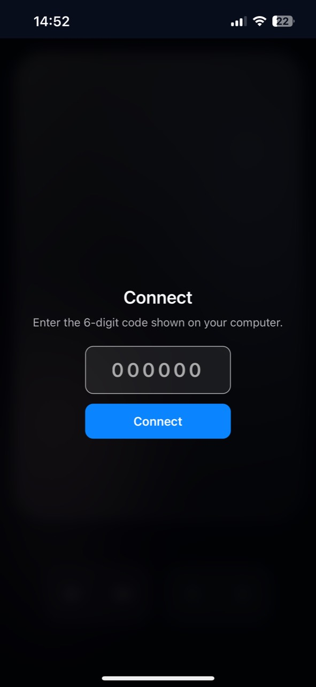
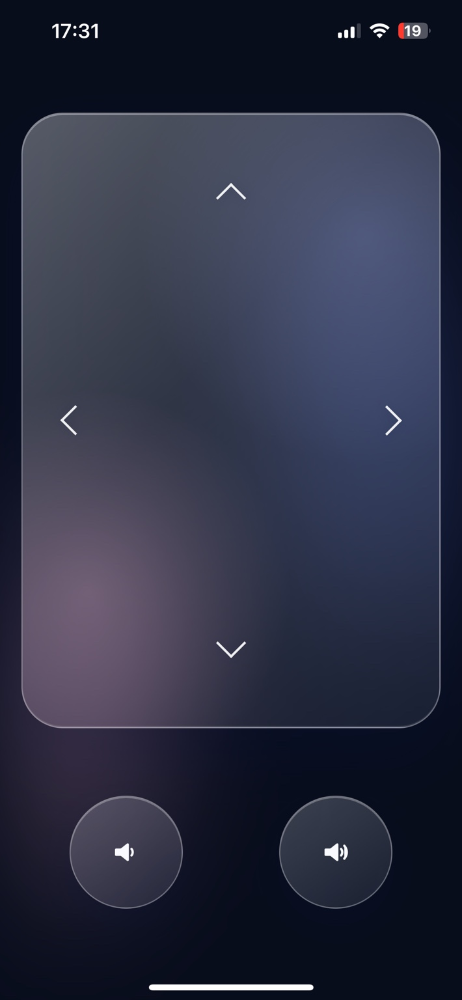
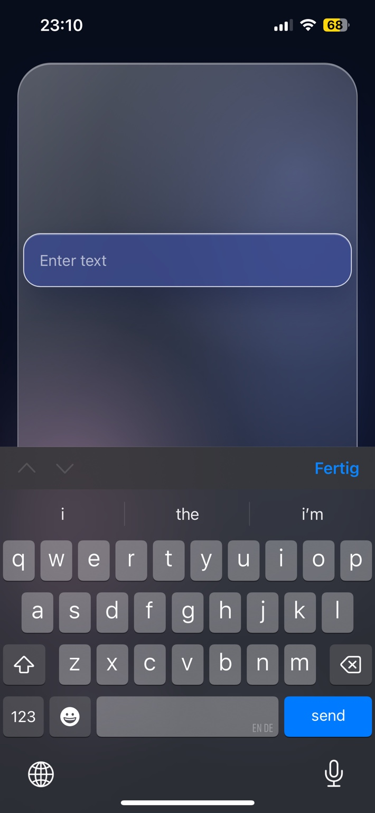

# Local Remote

Use your phone as a wireless touchpad and keyboard for your Windows PC over your local network.

No mobile app required.

<p align="start">
  
  
  
</p>


## Usage

1. Download the [latest release](https://github.com/enricoprma/local-remote/releases/latest).
2. Run the portable **Local Remote** executable on your PC.
3. Click the Local Remote tray icon to open the pairing window.
4. Scan the QR code with your phone.

Your PC and phone must be connected to the same local network.

### Manual connection and PWA

To connect manually or install Local Remote on your Home Screen, open:

```text
http://local-remote.local:3000
```

Then enter the six-digit code shown in the pairing window. If the local address does not open, use the IP address shown below it. Pairing codes expire after two minutes; close and reopen the pairing window to get a new one.

On iPhone, open the address in Safari and choose **Add to Home Screen**.

### Controls

* **Move** - drag with one finger
* **Click** - tap
* **Right-click** - tap with two fingers
* **Drag** - place three fingers on the touchpad and move them together; lifting any finger ends the drag. Lift all fingers before starting another gesture.
* **Scroll** - drag with two fingers
* **Type** - long press, enter text, then submit to type it and press Enter
* **Volume and arrow keys** - use the buttons below the touchpad

For recovery after a lost connection, a drag releases automatically after 15 seconds without movement. This also ends a stationary hold; start a new drag to continue.

### Administrator applications

Windows blocks simulated input from lower-privileged applications.

If you want to control an application that is running as administrator, start **Local Remote as administrator as well**.

## Build from source

Requires:

* Windows 10
* Node.js 22.12 or newer
* Python and Visual Studio Build Tools with **Desktop development with C++** if the native RobotJS dependency must be compiled locally

```powershell
git clone https://github.com/enricoprma/local-remote.git
cd local-remote
npm install
npm run dist
```

The portable Windows executable is created in `release/`.

> Control requires pairing, but traffic is not encrypted and the server listens on your local network. Pair only devices you trust and use Local Remote only on trusted networks. A paired browser remains authorized for up to 24 hours or until Local Remote restarts.
