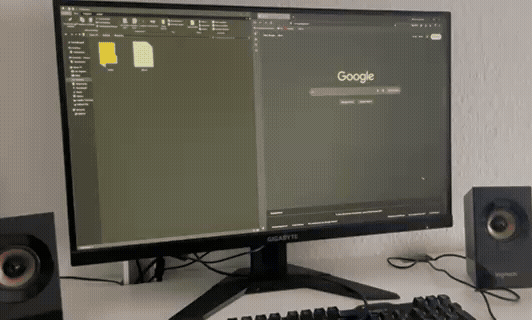

# Local Remote

A browser-based wireless touchpad and keyboard for Windows.

No mobile app required. Scan the QR code and control your PC over your local network.

<p align="start">
  
</p>

## Features

- Wireless touchpad and keyboard over LAN
- Move, click, right-click, scroll and drag
- Text input via long press
- Volume / arrow-key controls
- QR code and six-digit PIN pairing
- Portable Windows executable
- Automatic drag recovery after connection loss

## How it works

```text
Phone Browser
        │
        ▼
Web Client
├── Touchpad & Gesture Recognition
├── Controls & Text Input
├── Pairing
└── Remote / HTTP Client
        │
        │ HTTP over local network
        ▼
Desktop App
├── Express API
├── Authentication / Sessions
├── Input Abstraction
└── Electron Tray & Pairing UI
        │
        ▼
RobotJS
        │
        ▼
Windows
```

## Tech Stack

- TypeScript
- Electron
- Node.js
- Express
- RobotJS

## Usage

1. Download the [latest release](https://github.com/enricoprma/local-remote/releases/latest).
2. Run the portable **Local Remote** executable on your PC.
3. Click the Local Remote tray icon to open the pairing window.
4. Scan the QR code with your phone.

Your PC and phone must be connected to the same local network.

### Manual connection

To connect manually or install Local Remote on your Home Screen on iOS, open:

```text
http://local-remote.local:3000
```

Then enter the six-digit code shown in the pairing window. If the local address does not open, use the IP address shown below it. Pairing codes expire after two minutes; close and reopen the pairing window to get a new one.

On iPhone, open the address in Safari and choose **Add to Home Screen**.

### Controls

- **Move** - drag with one finger
- **Click** - tap
- **Right-click** - tap with two fingers
- **Drag** - place three fingers on the touchpad and move them together; lifting any finger ends the drag. Lift all fingers before starting another gesture.
- **Scroll** - drag with two fingers
- **Type** - long press, enter text, then submit to type it and press Enter
- **Volume and arrow keys** - use the buttons below the touchpad

For recovery after a lost connection, a drag releases automatically after 15 seconds without movement. This also ends a stationary hold; start a new drag to continue.

### Administrator applications

Windows blocks simulated input from lower-privileged applications.

If you want to control an application that is running as administrator, start **Local Remote as administrator as well**.

## Screenshots

<p align="start">
  
  
  
</p>

## Security

Local Remote is designed for trusted local networks.

- Pairing codes expire after two minutes.
- The pairing window closes after 10 failed pairing attempts.
- Successful pairing creates a session valid for up to 24 hours.
- Sessions are cleared when Local Remote restarts.
- Traffic is not encrypted.
- Only pair devices you trust and use Local Remote on trusted networks.

## Development & Quality

Testing:

- Vitest
- Supertest

Automated checks:

- ESLint
- Prettier
- TypeScript type checking
- Unit/integration tests
- Production build
- GitHub Actions CI

## Build from source

Requires:

- Windows 10
- Node.js 22.12 or newer
- Python and Visual Studio Build Tools with **Desktop development with C++** if the native RobotJS dependency must be compiled locally

```powershell
git clone https://github.com/enricoprma/local-remote.git
cd local-remote
npm ci
npm run dist
```

The portable Windows executable is created in `release/`.
